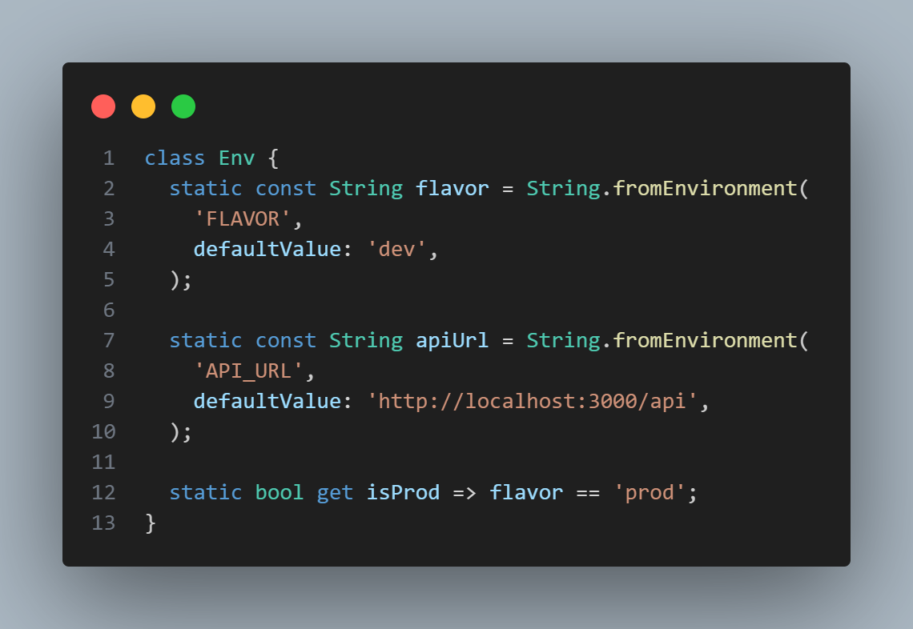
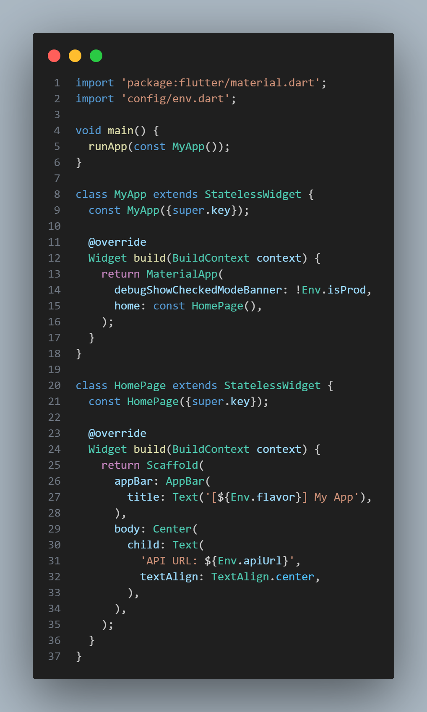
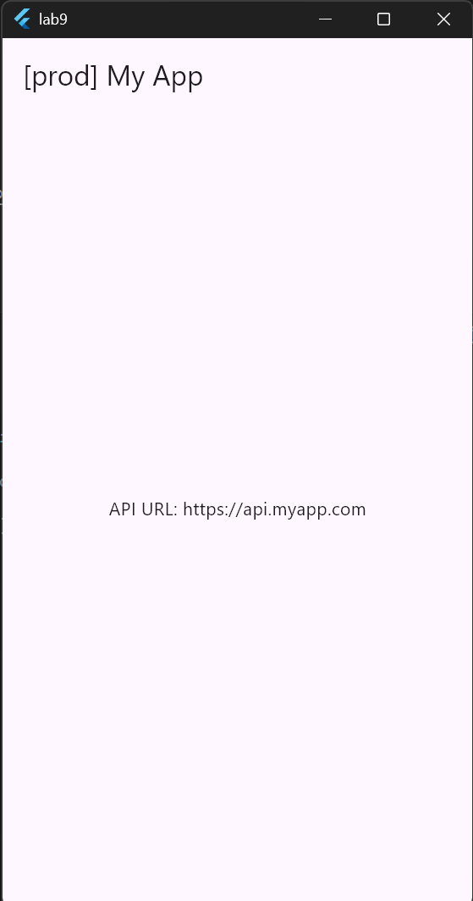
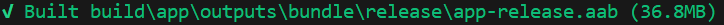
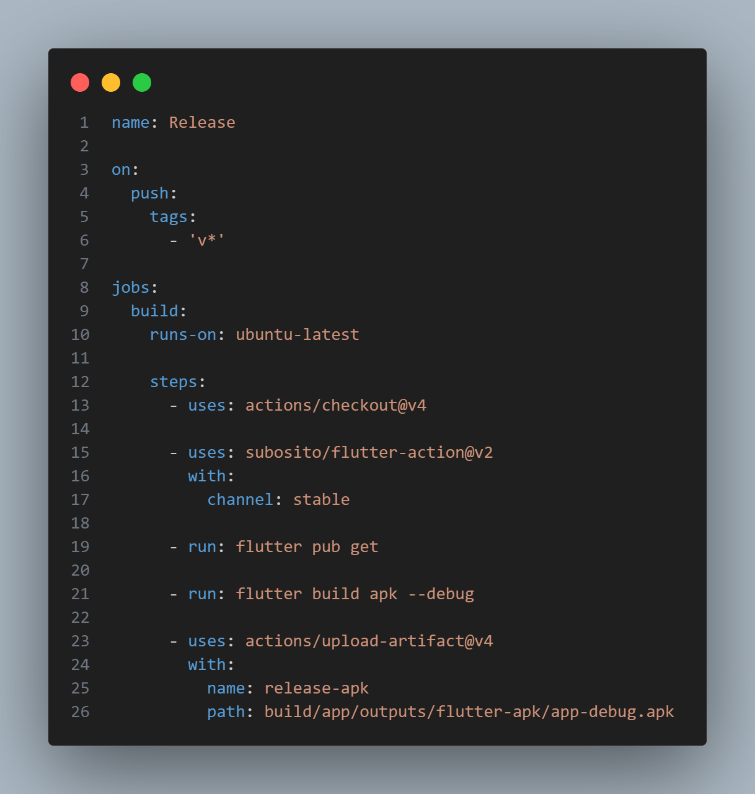
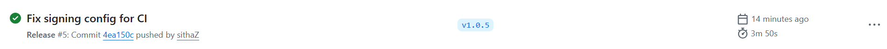
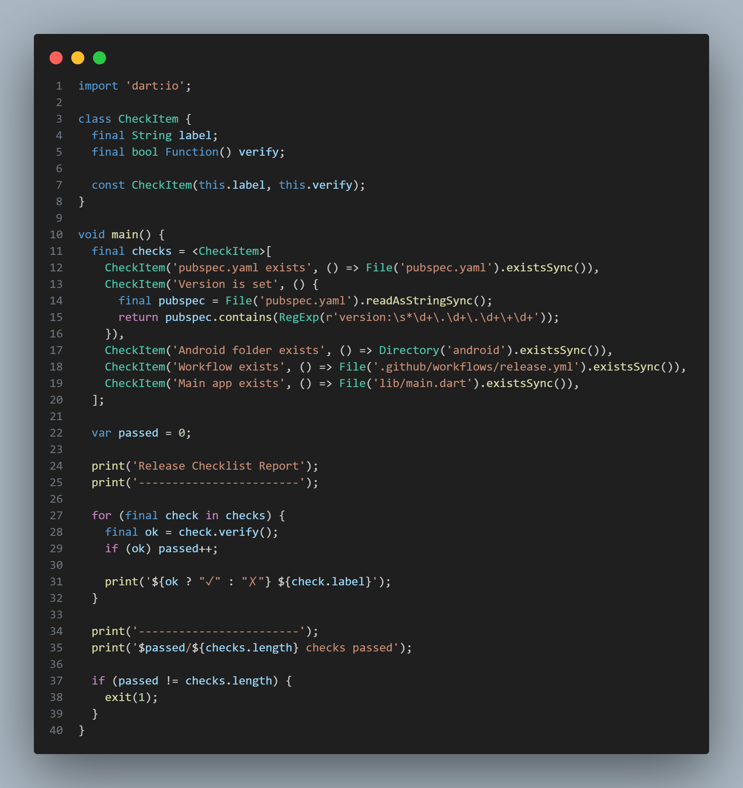
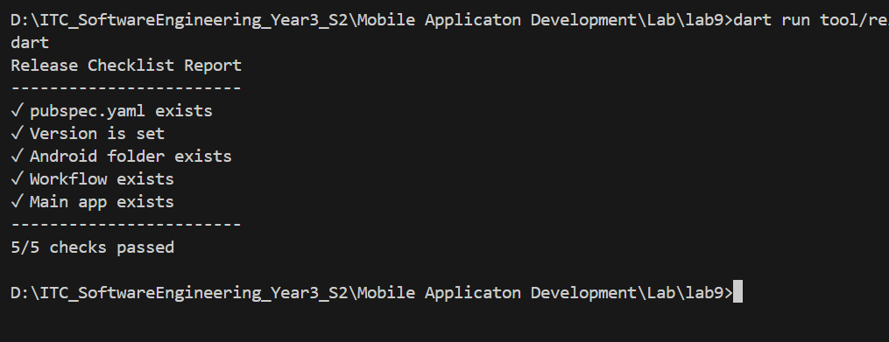
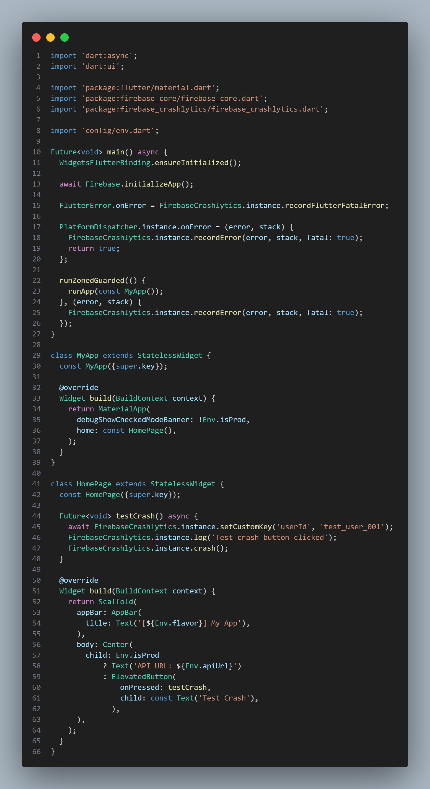

# MobileDev-Lab9 
# Lab 09 – Build, Release & Ship to the Stores

## Student Information

* Name: Huoth Sitha
* Course: Mobile Application Development


---

# Exercise 1 – Multi-Flavor Configuration

## Objective

Configure multiple application environments using Flutter flavors and display the active flavor in the application.

## Implementation

* Created `lib/config/env.dart`
* Added `FLAVOR` and `API_URL` using `String.fromEnvironment`
* Added `isProd` helper
* Displayed flavor in the AppBar
* Used `--dart-define` to switch environments

## Evidence

### Code





### Result



---

# Exercise 2 – Android Release Signing

## Objective

Configure Android signing and generate a signed release bundle.

## Implementation

* Generated upload keystore
* Created `key.properties`
* Configured signing in `build.gradle.kts`
* Generated signed Android App Bundle

## Result



Generated artifact:

```text
build/app/outputs/bundle/release/app-release.aab
```

---

# Exercise 3 – GitHub Actions Release Workflow

## Objective

Create a CI/CD workflow that automatically builds the application when a version tag is pushed.

## Implementation

* Created `.github/workflows/release.yml`
* Configured GitHub Actions
* Triggered workflow using version tags

## Code



## Result



---

# Exercise 4 – Release Checklist Automation

## Objective

Automate release readiness verification.

## Implementation

Created a checklist script to verify:

* pubspec.yaml
* version number
* android folder
* workflow configuration
* application entry point

## Code



## Result



Output:

```text
5/5 checks passed
```

---

# Exercise 5 – Crash Reporting Integration

## Objective

Integrate Firebase Crashlytics into the Flutter application.

## Implementation

* Added Firebase Core
* Added Firebase Crashlytics
* Initialized Firebase
* Configured Flutter error handling
* Added test crash functionality

## Code



---

